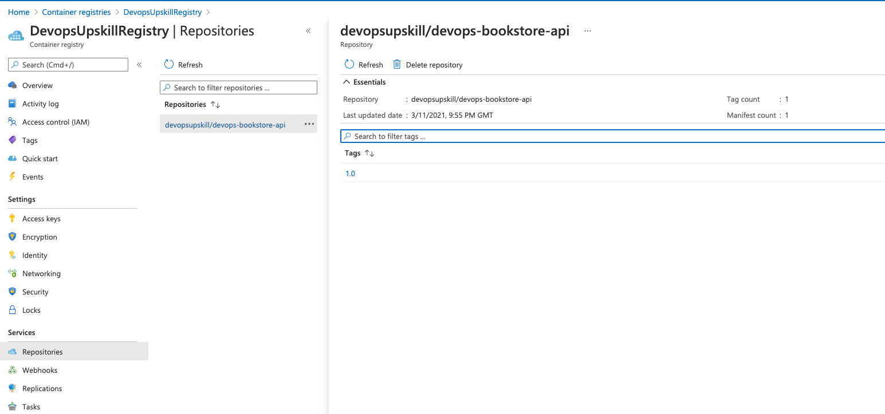

## Instructions

The next phase for getting your custom Docker images deployed is to push them to your very own private container registry.

By now you will have provisioned a container registry on Azure so now we have somewhere to push our Docker images.

### Step 1 - Ensure you have an image to push

Firstly we'll need to make sure we have a docker image of our application ready to push.

Let's push up an image of the Python app we worked with in session 3.

Navigate to the directory for that application (that you cloned in session 3).

It's on the link below if you need to re-clone

https://github.com/techreturners/devops-bookstore-api

### Step 2 - Build the docker image

Make sure Docker is running on your computer and build the docker image by running this command:

```
docker build -t devops-bookstore-api:1.0 .
```

That will produce a local docker image. One that we can PUSH up to your container registry.

### Step 3 - Authenticating docker to allow the push

Next we need to make sure your local docker instance has the right credentials to push up to your container registry. 

To authenticate with the container registry, replace the REGISTRY_NAME in the following command with your registry name and then run:

```
az acr login --name REGISTRY_NAME
```

It should so something similar to:

```
Uppercase characters are detected in the registry name. When using its server url in docker commands, to avoid authentication errors, use all lowercase.
Login Succeeded
```

### Step 4 - Tag your docker image with the location of your registry

The way you tell Docker about your container registries is through the tagging system.

You can tag the image you built in step 2 with a new tag for your container registry. To do this (replace the REGISTRY_NAME with your Azure registry name):

```
docker tag devops-bookstore-api:1.0 REGISTRY_NAME.azurecr.io/devopsupskill/devops-bookstore-api:1.0
```

You can see your Docker images by running `docker images` and you should see your tagged version.

### Step 5 - Push your image

Once the image has been tagged and you have configured docker to be authenticated with your account you should be able to push your image. 

Remember the registry name will be slightly different to the example shown below.

```
docker push REGISTRY_NAME.azurecr.io/devopsupskill/devops-bookstore-api:1.0
```

If all works you should see it show progress of your "push"

### Step 6 - Check the image through your Azure console

If you then open up the Azure web console you should be able to navigate to the container registry and see your image. It should look similar to the image below:



You can now head back to the [README](../README.md) and lets work through getting that image deployed.